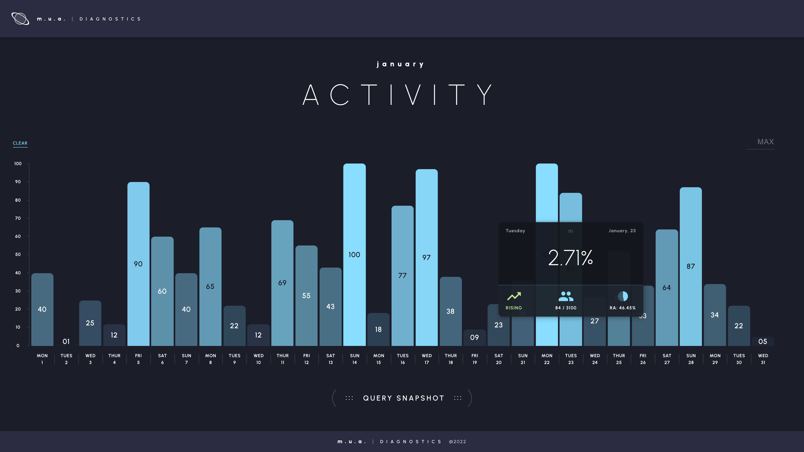
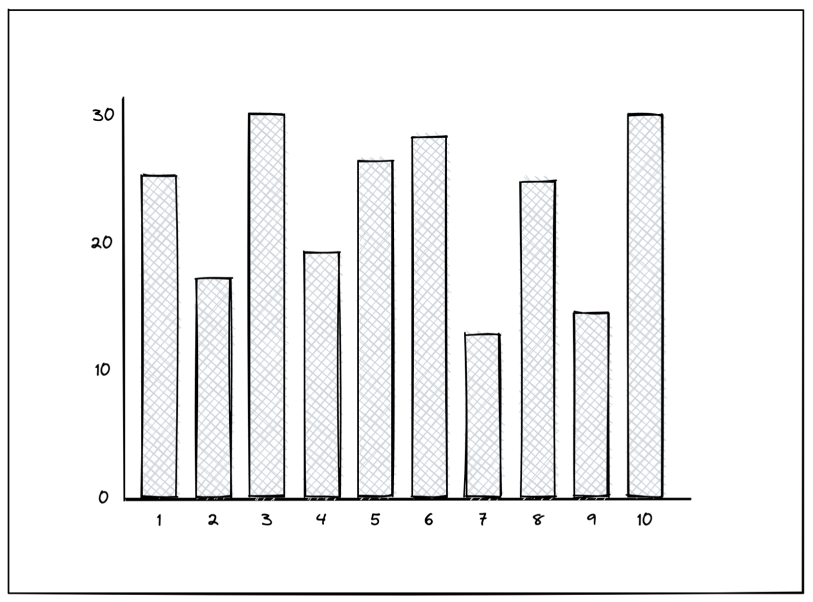

# Bar Chart Challenge (v1.1.1)



This project was inspired by a challenge I read from a post stating one simple instruction: build a bar chart and feed it data from this endpoint: <https://www.random.org/integers/?num=200&min=1&max=10&col=1&base=10&format=plain&rnd=new>.



Other notes:

- Additional criteria I added was it had to built from scratch (no UI libraries).

- Started to explore animation transitions between the different states.

---

## Setup

1. Download repo and install packages @ root

```shell
npm install
```

2. Run

```shell
npm run start
```

Runs the app in the development mode.\
Open [http://localhost:3000](http://localhost:3000) to view it in your browser.
